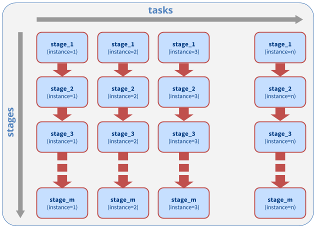

.. _ensemble_of_pipelines_example:

***********************************
Ensemble of Pipelines (EoP) Example
***********************************

This example shows how to use the Ensemble Toolkit ``Ensemble of Pipelines`` pattern
to execute 16 concurrent pipelines of sequential tasks. In the first step of
each pipeline ``stage_1``, a 10 MB input file is generated and filled with
ASCII charaters. In the second step ``stage_2``, a character frequency analysis
if performed on this file. In the last step ``stage_3``, an SHA1 checksum is
calculated for the analysis result. The results of the frequency analysis and
the SHA1 checksums are copied back to the machine on which this script runs.

	Fig.: `Ensemble of Pipelines Pattern`

Run Locally
===========

.. warning:: In order to run this example, you need access to a MongoDB server and
	set the ``RADICAL_PILOT_DBURL`` in your environment accordingly.
	The format is ``mongodb://hostname:port``. Read more about it
	MongoDB in chapter :ref:`envpreparation`.

**Step 1:** View and download the example sources :ref:`below <example_source_ensemble_of_pipelines>`  or find it in 
your virtualenv under ``share/radical.ensemblemd/examples/ensemble_of_pipelines.py``.

**Step 2:** Run this example with ``RADICAL_ENTK_VERBOSE`` set to ``REPORT``::

	RADICAL_ENTK_VERBOSE=REPORT python ensemble_of_pipelines.py

Once the script has finished running, you should see the raw data of the
character analysis step (``cfreqs-XX.dat``) and the corresponding SHA1 checksums
(``cfreqs-XX.dat.sha1``) in the same directory you launched the script in.

You can generate a more verbose output by setting ``RADICAL_ENTK_VERBOSE=INFO``.

Run Remotely
============

By default, the ensembles run on one core your local machine

.. literalinclude:: ../../../examples/ensemble_of_pipelines.py
	:lines: 69-76
	:language: python
	:dedent: 2

You can change the script to use a remote HPC cluster and increase the number
of cores to see how this affects the runtime of the script as the individual
pipeline instances can run in parallel::

	cluster = ResourceHandle(
		resource="xsede.stampede",
		cores=16,
		walltime=30,
		username=None,  # add your username here
		project=None # add your allocation or project id here if required
		database_url=None # add your mongodb url
	)

.. _example_source_ensemble_of_pipelines:

Example Source
==============

:download:`Download example: pipeline.py <../../../examples/ensemble_of_pipelines.py>`

.. literalinclude:: ../../../examples/ensemble_of_pipelines.py
	 :language: python
