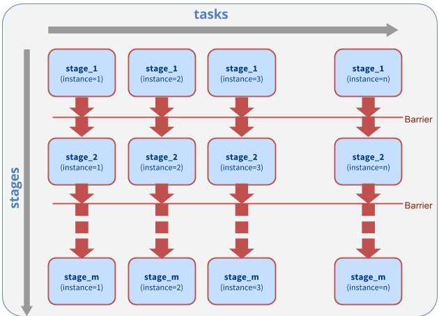

.. _pipeline_of_ensembles_example:

***********************************
Pipeline of Ensembles (PoE) Example
***********************************

This example shows how to use the Ensemble Toolkit :class:`.BagofTasks` pattern
to execute a single stage "Pipeline of Ensembles". The "instances" of the  :class:`.BagofTasks`
corresponds to the number of ensemble members.

	 Fig.: `A Pipeline of Ensembles pattern with M stages and N ensemble members`

Run Locally
===========

.. warning:: In order to run this example, you need access to a MongoDB server and
		set the ``RADICAL_PILOT_DBURL`` in your environment accordingly.
		The format is ``mongodb://hostname:port``. Read more about it
		MongoDB in chapter :ref:`envpreparation`.

**Step 1:** View and download the example sources :ref:`below <example_source_pipeline_of_ensembles>` or find it in 
your virtualenv under ``share/radical.ensemblemd/examples/pipeline_of_ensembles.py``.

**Step 2:** Run this example with ``RADICAL_ENTK_VERBOSE`` set to ``REPORT``.::

	RADICAL_ENTK_VERBOSE=REPORT python pipeline_of_ensembles.py

Once the script has finished running, you should see the SHA1 checksums
genereated by the individual tasks  (``checksumXX.sha1``) in the in the same
directory you launched the script in.

You can generate a more verbose output by setting ``RADICAL_ENTK_VERBOSE=INFO``.

Run on a Remote Cluster
=======================

By default, this Pipeline of Ensembles runs on one core on your local machine.

.. literalinclude:: ../../../examples/pipeline_of_ensembles.py
	:lines: 64-74
	:language: python
	:dedent: 2

You can change the script to use a remote HPC cluster and increase the number
of cores to see how this affects the runtime of the script as the individual
tasks in the each stage of the pipeline can run in parallel.

.. code-block:: python

	cluster = ResourceHandle(
		resource="xsede.stampede",
		cores=16,
		walltime=30,
		username=None,  # add your username here
		project=None # add your allocation or project id here if required
		database_url=None # add your mongodb url
	)

.. _example_source_pipeline_of_ensembles:

Example Source
==============

:download:`Download example: pipeline_of_ensembles.py <../../../examples/pipeline_of_ensembles.py>`

.. literalinclude:: ../../../examples/pipeline_of_ensembles.py
	 :language: python
