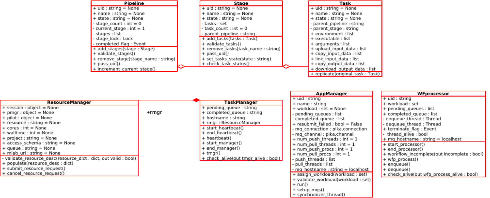

.. _uml:

***
UML
***

This page presents the UML diagrams for the Ensemble Toolkit. Additional information to help understand 
the design of Ensemble Toolkit is also presented for interested developers.

Class Diagram
=============

The following document describes the classes in EnTK, their data members and functional members.

Sequence Diagram
================

The interaction of these modules for one successful run of an application is described in the 
following figure:

.. image:: ../figures/sequence_diagram.png
   :target: ../figures/sequence_diagram.png

Communication Model
===================

[TODO]