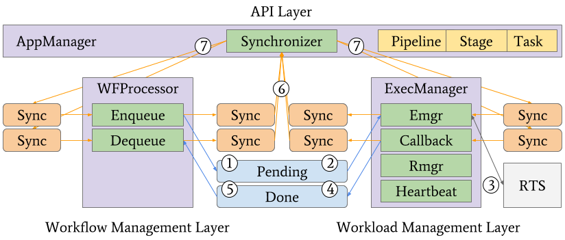
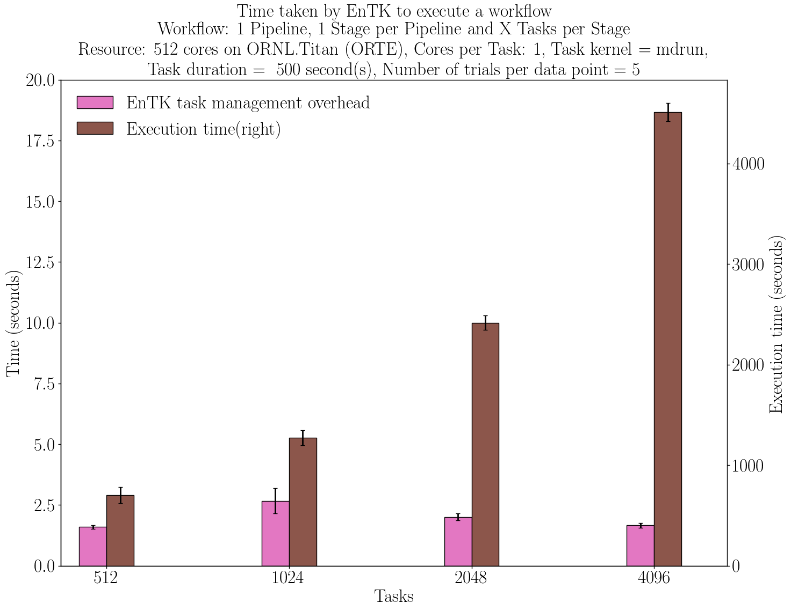

.. _entk:

****************
Ensemble Toolkit
****************

The design and implementation of EnTK are iterative and driven by use cases. 
Use cases span several scientific domains, including Biomolecular Sciences, 
Material Sciences, and Earth Sciences. Users and developers collaborate to 
elicit requirements and rapid prototyping

Design
======

We describe how applications modeled using EnTK components, the architecture
and execution model of EnTK. We also specify the types of failures recognized
by EnTK and how some of the failures are handled.

.. _app_model:

Application Model
-----------------

We model an application by combining the Pipeline, Stage and Task (PST) 
components.

.. figure:: figures/pst-model.jpg
 :width: 400pt
 :align: center
 :alt: Ensemble Toolkit Design - high level

 `Figure 1: PST Model`

We consider two pythonic collections of objects, **Sets** and **Lists**, to 
describe the task graph. A **set**-based object represents entities that have 
**no relative order** and hence can execute independently. A **list**-based 
object represents entities that have a linear **temporal** order, i.e. entity 
'i' can only be operated after entity 'i-1'. 

In our PST model, we have the following objects:

* **Task**: an abstraction of a computational task that contains information regarding an executable, its software environment and its data dependences.
* **Stage**: a set of tasks without mutual dependences and that can be executed concurrently.
* **Pipeline**: a list of stages where any stage i can be executed only after stage i−1 has been executed.

The entire application when assigned to the Application Manager can be expressed
as a set of Pipelines. A graphical representation of an application is provided
in Figure 1. Note how different Pipelines can have different number of Stages 
and different Stages can have different number of Tasks.

By expressing your application as a set or *list* of such Pipelines, one can 
create any application that can be expressed as a DAG.

Architecture
------------

EnTK sits between the user and the CI, abstracting resource management 
and execution management from the user. 

 `Figure 2: Ensemble Toolkit Architecture and Execution Model`

Fig. 2 shows the components (purple) and subcomponents (green) of EnTK, 
organized in three layers: API, Workflow Management, and Workload Management.
The API layer enables users to codify PST descriptions. The Workflow Management 
layer retrieves information from the user about available CIs, initializes EnTK,
and holds the global state of the application during execution. The Workload 
Management layer acquires resources via the RTS. The Workflow Management layer 
has two components: AppManager and WFProcessor. AppManager uses the Synchronizer
subcomponent to update the state of the application at runtime. WFProcessor uses
the Enqueue and Dequeue subcomponents to queue and dequeue tasks from the Task 
Management layer. The Workload Management layer uses ExecManager and its Rmgr, 
Emgr, RTS Callback, and Heartbeat subcomponents to acquire resources from CIs 
and execute the application.

This architecture is the isolation of the RTS into a stand-alone subsystem. This
enables composability of EnTK with diverse RTS and, depending on capabilities,
multiple types of CIs.

Execution Model
---------------

Once EnTK is fully initialized, WFProcessor initiates the execution by creating 
a local copy of the application description from AppManager and tagging tasks 
for execution. Enqueue pushes these tasks to the Pending queue (Fig. 2, 1). Emgr
pulls tasks from the Pending queue (Fig. 2, 2) and executes them using a RTS 
(Fig. 2, 3). RTS Callback pushes tasks that have completed execution to the 
Done queue (Fig. 2, 4). Dequeue pulls completed tasks (Fig. 2, 5) and tags them
as done, failed or canceled, depending on the return code of the RTS. Each 
component and subcomponent synchronizes state transitions of pipelines, stages 
and tasks with AppManager by pushing messages through dedicated queues (Fig. 2,
6). AppManager pulls these messages and updates the application states. 
AppManager then acknowledges the updates via dedicated queues (Fig. 2, 7). 
This messaging mechanism ensures that AppManager is always up-to-date with any 
state change, making it the only stateful component of EnTK.

Failure Model
-------------

We consider four main sources of failure: EnTK components, RTS, CI, and task 
executables. All state updates in EnTK are transactional, hence any EnTK 
component that fails can be restarted at runtime without losing information
about ongoing execution. Both the RTS and the CI are considered black boxes. 
Partial failures of their subcomponents at runtime are assumed to be handled 
locally. CI-level failures are reported to EnTK indirectly, either as a failed 
pilots or failed tasks. Both pilots and tasks can be restarted. Failures are 
logged and reported to the user at runtime for live or postmortem analysis

Implementation
==============

EnTK is implemented in Python, uses RabbitMQ message queuing system and the 
RADICAL-Pilot (RP) runtime system. All EnTK components are implemented as 
processes, and all subcomponents as threads.

RabbitMQ is a server-based system and requires to be installed before the 
execution of EnTK. This adds overheads but it also offers the following 
benefits: (1) producers and consumers do not need to be topology aware because 
they interact only with the server; (2) messages are stored in the server and
can be recovered upon failure of EnTK components; and (3) messages can be pushed
and pulled asynchronously because data can be buffered by the server upon 
production.

RP is a runtime system designed to execute ensemble applications via pilots. 
Pilots provide a multi-stage execution mechanism: Resources are acquired via a 
placeholder job and subsequently used to execute the application’s tasks. When a
pilot is submitted to a CI as a job, it waits in the CI’s queue until the 
requested resources become available. At that point, the CI’s scheduler 
bootstraps the job on the CI’s compute nodes.

You can view the :ref:`class diagram <dev_docs_cls_diag>` and 
:ref:`sequence diagram <dev_docs_seq_diag>` and more in the 
:ref:`developer documentation <dev_docs>`.

.. _entk_perf_plots:

Performance
===========

Below we present the weak and strong scaling behavior of EnTK on the ORNL
Titan machine.

Detailed description of the experiments can be found in 
`technical paper <https://arxiv.org/pdf/1710.08491>`_.

.. figure:: figures/entk_weak_scaling.png
 :width: 400pt
 :align: center
 :alt: Ensemble Toolkit Architecture and Execution Model

 `Figure 3: Weak scalability on Titan: 512, 1,024, 2,048, and 4,096 1-core tasks executed on the same amount of cores`

 `Figure 4: Strong scalability on Titan: 8,192 1-core tasks are executed on 1,024, 2,048 and 4,096 cores`