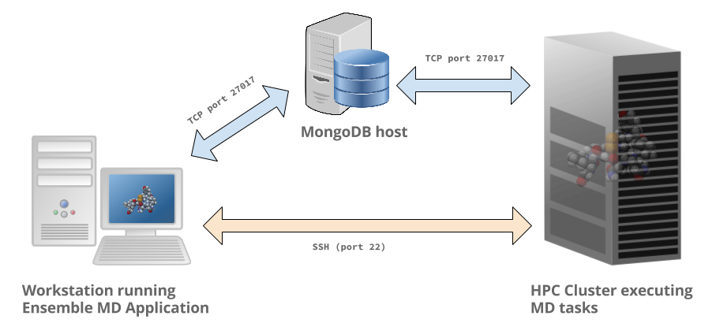

.. _installation:

************
Installation
************

Installing Ensemble Toolkit
===========================

To install the Ensemble Toolkit, we need to create a virtual environment. Open a terminal and run:

.. code-block:: bash

        virtualenv $HOME/myenv
        source $HOME/myenv/bin/activate


Currently, we use the devel stack of radical.utils, saga-python, radical.pilot with arch/v0.6 branch of radical.entk. To
setup the same environment, run the following in the same terminal.

.. code-block:: bash

        cd $HOME
        git clone https://github.com/radical-cybertools/radical.utils
        git clone https://github.com/radical-cybertools/saga-python
        git clone https://github.com/radical-cybertools/radical.pilot
        git clone https://github.com/vivek-bala/radical.entk.git
        cd radical.entk
        git checkout arch/v0.6
        cd ..
        pip install radical.utils/ saga-python/ radical.pilot/ radical.entk/

You can check the version of Ensemble MD Toolkit with the ```entk-version``` command-line tool. It should return 0.6.

.. code-block:: bash

        entk-version
        0.6.0


Installing rabbitmq
===================

Ensemble toolkit relies on RabbitMQ for message transfers. Installation 
instructions can be found at ```https://www.rabbitmq.com/download.html```. At 
the end of the installation run ```rabbitmq-server``` to start the server. RabbitMQ needs to be installed
on the same machine as where EnTK is installed.

In some cases, you might have to explicitly start the rabbitmq-server after installation. You can check if the 
rabbitmq-server process is alive. If not, please run the following:

.. code-block:: bash

        rabbitmq-server -detached


Installing rabbitmq using docker
--------------------------------

If installing rabbitmq directly seems to be cumbersome, you can also install a docker instance of rabbitmq. Assuming
you have docker installed, you can download and run the rabbitmq instance using the following command:

.. code-block:: bash

        docker run -d --name <name of instance> -P rabbitmq:3

The '-P' argument auto maps new ports from localhost to the ports expected by rabbitmq. This is useful if you want
to have multiple EnTK scripts running as you would require multiple rabbitmq instances.

You can see the mapping of the ports running ```docker ps```.

.. code-block:: bash

        vivek@two:~$ docker run -d --name rabbit-1 -P rabbitmq:3
        fb8ee8bfd822656a6338b7c19fa6a9641944f8bf5de5c1414fb78d049fdffc42
        vivek@two:~$ docker ps
        CONTAINER ID        IMAGE               COMMAND                  CREATED             STATUS              PORTS                                                                                                 NAMES
        fb8ee8bfd822        rabbitmq:3          "docker-entrypoint..."   9 seconds ago       Up 7 seconds        0.0.0.0:32777->4369/tcp, 0.0.0.0:32776->5671/tcp, 0.0.0.0:32775->5672/tcp, 0.0.0.0:32774->25672/tcp   rabbit-1


Interactions between RabbitMQ and EnTK are done through port 5672 by default. For the above docker instance, we need to 
use port 32775. In your EnTK scripts, while creating the AppManager, you need to specify port=32776.


Installation Video
==================


.. raw:: html

        <video controls src="_static/entk_installation_get_started.mp4"></video> 


Preparing the Environment
=========================

Ensemble Toolkit uses `RADICAL Pilot <http://radicalpilot.readthedocs.org>`_ as the runtime system. RADICAL Pilot can 
access HPC clusters remotely via SSH and GSISSH, but it requires (a) a MongoDB server and (b) a properly set-up 
passwordless SSH/GSISSH environment.


MongoDB Server
--------------



The MongoDB server is used to store and retrieve operational data during the
execution of an application using RADICAL-Pilot. The MongoDB server must
be reachable on **port 27017** from **both**, the host that runs the
Ensemble Toolkit application and the host that executes the MD tasks, i.e.,
the HPC cluster (see blue arrows in the figure above). In our experience,
a small VM instance (e.g., Amazon AWS) works exceptionally well for this.

.. warning:: If you want to run your application on your laptop or private
            workstation, but run your MD tasks on a remote HPC cluster,
            installing MongoDB on your laptop or workstation won't work.
            Your laptop or workstations usually does not have a public IP
            address and is hidden behind a masked and firewalled home or office
            network. This means that the components running on the HPC cluster
            will not be able to access the MongoDB server.

A MongoDB server can support more than one user. In an environment where
multiple users use Ensemble Toolkit, a single MongoDB server
for all users / hosts is usually sufficient.

**Install your own MongoDB**

Once you have identified a host that can serve as the new home for MongoDB,
installation is straight forward. You can either install the MongoDB
server package that is provided by most Linux distributions, or
follow the installation instructions on the MongoDB website:

http://docs.mongodb.org/manual/installation/

**MongoDB-as-a-Service**

There are multiple commercial providers of hosted MongoDB services, some of them
offering free usage tiers. We have had some good experience with the following:

* https://mongolab.com/


.. _ssh_gsissh_setup:

Setup passwordless SSH Access to machines
-----------------------------------------

In order to create a passwordless access to another machine, you need to create a RSA key on your local machine
and paste the public key into the `authorizes_users` list on the remote machine.

`This <http://linuxproblem.org/art_9.html>`_ is a recommended tutorial to create password ssh access.

An easy way to setup SSH access to multiple remote machines is to create a file ``~/.ssh/config``.
Suppose the url used to access a specific machine is ``foo@machine.example.com``. You can create an entry in this 
config file as follows:

.. code-block:: bash

        # contents of $HOME/.ssh/config
        Host machine1
                HostName machine.example.com
                User foo

Now you can login to the machine by ``ssh machine1``.


Source: http://nerderati.com/2011/03/17/simplify-your-life-with-an-ssh-config-file/


Setup GSISSH Access to a machine
---------------------------------

Setting up GSISSH access to a machine is a bit more complicated. We have documented the steps to setup GSISSH on
`Ubuntu <https://github.com/vivek-bala/docs/blob/master/misc/gsissh_setup_stampede_ubuntu_xenial.sh>`_ (tested for 
trusty and xenial) and `Mac <https://github.com/vivek-bala/docs/blob/master/misc/gsissh_setup_mac>`_. Simply execute 
all the commands, see comments for details.

The above links document the overall procedure and get certificates to access XSEDE machines. Depending on the machine
you want to access, you will have to get the certificates from the corresponding locations. In most cases, this
information is available in their user guide. 


Troubleshooting
=======================

**Missing virtualenv**

This should return the version of the RADICAL-Pilot installation, e.g., `0.X.Y`.

If virtualenv **is not** installed on your system, you can try the following.

.. code-block:: bash

        wget --no-check-certificate https://pypi.python.org/packages/source/v/virtualenv/virtualenv-1.9.tar.gz
        tar xzf virtualenv-1.9.tar.gz

        python virtualenv-1.9/virtualenv.py $HOME/myenv
        source $HOME/myenv/bin/activate

**TypeError: 'NoneType' object is not callable**

Note that some Python installations have a broken multiprocessing module -- if you
experience the following error during installation::

    Traceback (most recent call last):
        File "/usr/lib/python2.7/atexit.py", line 24, in _run_exitfuncs
            func(*targs, **kargs)
        File "/usr/lib/python2.7/multiprocessing/util.py", line 284, in _exit_function
            info('process shutting down')
    TypeError: 'NoneType' object is not callable

    you may need to move to Python 2.7 (see http://bugs.python.org/issue15881).