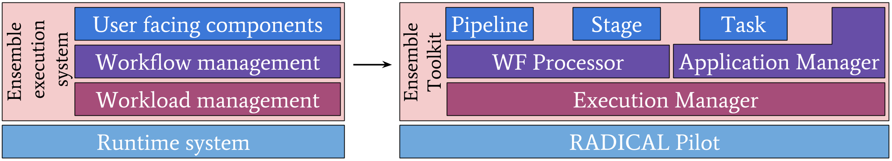

.. _introduction:

************
Introduction
************

Overview
========

The Ensemble Toolkit is a Python framework for developing and executing 
applications comprised of multiple sets of tasks, aka ensembles. Ensemble 
Toolkit was originally developed with ensemble-based applications in mind. As 
our understanding of the variety of workflows in scientific application 
improved, we realized our approach needs to be more generic. Although our 
motivation remains that of Ensemble-based applications, from EnTK 0.6 onwards, 
any application where the task workflow can be expressed as a Directed Acyclic 
Graph, can be supported.

The Ensemble Toolkit has the following unique features: (i) abstractions that 
enable the expression of various task graphs, (ii) abstraction of resource 
management and task execution, (iii) Fault tolerance as a first order concern
and (iv) well-established runtime capabilities to enable efficient and dynamic 
usage of grid resources and supercomputers.

We will now discuss the high level design of Ensemble Toolkit in order to 
understand how an application is created and executed.

Design
------

   `Figure 1: High level design of Ensemble Toolkit`

Ensemble toolkit consists of several components that serve different purposes. 
There are three user level components, namely, Pipeline, Stage and Task, that 
are used directly by the user. The **Pipeline**, **Stage** and **Task** are 
components used to create the application by describing its task graph. We will 
soon take a look into how these can be used to create an application.

The **Application Manager** is an internal component, that takes a workflow 
described by the user and converts it into a set of **workloads**, i.e. tasks
with no dependencies by parsing through the workflow and identifying, during 
runtime, tasks with equivalent or no dependencies. The Application Manager
also accepts the description of the resource request (with resource
label, walltime, cpus, gpus, user credentials) to be created.

The **Execution Manager** is the last component in Ensemble Toolkit. It 
accepts the workloads prepared by the Application Manager and executes them on 
the specified resource using a Runtime system (RTS). Internally, it consists of 
two subcomponents: ResourceManager and TaskManager, that are responsible for the
allocation, management, and deallocation of resources, and execution management
of tasks, respectively. The Execution Manager is currently configured to use
`RADICAL Pilot (RP) <http://radicalpilot.readthedocs.org>`_ as the runtime 
system, but can be extended to other RTS.

Ensemble Toolkit uses a runtime system as a framework to simply execute tasks 
on computing infrastructures (CIs). The runtime system is expected to manage 
the direct interactions with the various software and hardware layers of the 
CIs, including the heterogeneity amongst various CIs.

More details about how EnTK is designed and implemented can be found 
:ref:`here <entk>`.

.. _dependency:

Dependencies
------------

Ensemble Toolkit uses `RADICAL Pilot (RP) <http://radicalpilot.readthedocs.org>`_ 
as the runtime system. RP is targeted currently only for a set of high 
performance computing (HPC) systems 
(`see here <http://radicalpilot.readthedocs.io/en/latest/resources.html#chapter-resources>`_). 
RP can be extended to support more HPC systems by contacting the developers of 
RP/EnTK or by the user themselves by following 
`this page <http://radicalpilot.readthedocs.io/en/latest/machconf.html#writing-a-custom-resource-configuration-file>`_.

Ensemble Toolkit also relies on RabbitMQ to support messaging capabilities 
between its various components. Read more about it `here <http://www.rabbitmq.com/>`_.

EnTK also has profiling capabilities and uses `Pandas <https://pandas.pydata.org/>`_ 
dataframes to store the data. Users can use these dataframes to wrangle the data
or directly plot the required fields.

Dependencies such as RP and Pandas are automatically installed when installing 
EnTK. RabbitMQ, on the other hand, needs to be installed manually by the user.
Instructions are provided :ref:`here <installation>`.

Five steps to create an application
-----------------------------------

1. Use the Pipeline, Stage and Task components to create the workflow.
2. Create an Application Manager (Amgr) object with required parameters/configurations.
3. Describe the resource request to be created. Assign resource request description and workflow to the Amgr.
4. Run the Application Manager.
5. Sit back and relax!

Jump ahead to take a look at the step by step instructions for an example
script :ref:`here <uguide_get_started>`.

Intended users
==============

Ensemble Toolkit is completely Python based and requires familiarity with the 
Python language. 

Our primary focus is to support domain scientists and enable them to execute 
their applications at scale on various CIs. This, however, does not mean that this 
framework cannot be used by users with simpler requirements. Consider using EnTK for
its automation and fault-tolerance capabilities, even if it requires no HPC (even on your personal PC!).

Some of our current users are mentioned below.

+------------------------+---------------+
| User Groups            |   Domain      |
+========================+===============+
| University of Colorado,| Biochemistry/ |
| Denver                 | Biophysics    |
+------------------------+---------------+
| Penn State University  | Climate       |
|                        | Science       |
+------------------------+---------------+
| Princeton University   | Seismology    |
+------------------------+---------------+
| University College of  | Biochemistry/ |
| London                 | Biophysics    |
|                        | Medicine      |
+------------------------+---------------+
| Rice University        | Biochemistry/ |
|                        | Biophysics    |
+------------------------+---------------+
| Stony Brook University | Polar         |
|                        | Science       |
+------------------------+---------------+
| Northern Arizona       | Polar         |
| University             | Science       |
+------------------------+---------------+
| Oak Ridge National     | Biochemistry/ |
| Laboratory             | Biophysics    |
+------------------------+---------------+
